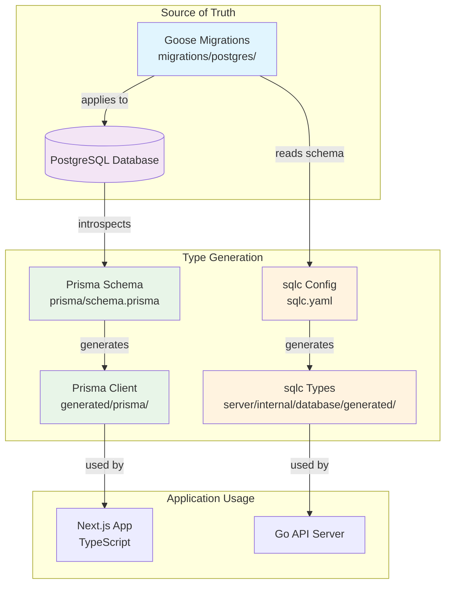

# Schema Architecture & Synchronization

This document describes how database schemas are managed and synchronized across different tools in the Errly project.

## 🏗️ Schema Architecture



## 📋 Schema Sources

### 1. **Goose Migrations** (Source of Truth)
- **Location**: `migrations/postgres/`
- **Purpose**: Define database schema changes
- **Format**: SQL with `-- +goose Up` and `-- +goose Down` annotations
- **Status**: ✅ Applied to database

### 2. **Prisma Schema** (Generated)
- **Location**: `prisma/schema.prisma`
- **Purpose**: TypeScript type generation
- **Source**: Generated from database via `prisma db pull`
- **Status**: ✅ Synchronized with database

### 3. **sqlc Configuration** (Reads Migrations)
- **Location**: `sqlc.yaml`
- **Purpose**: Go type generation
- **Source**: Reads schema from Goose migrations
- **Status**: ✅ Reading from migrations

## 🔄 Synchronization Workflow

### When Creating New Features:

```bash
# 1. Create new migration (source of truth)
npm run db:create:postgres add_new_feature

# 2. Edit migration file
# migrations/postgres/20240601000005_add_new_feature.sql

# 3. Apply migration to database
npm run dev:migrate

# 4. Regenerate all types
npm run dev:types

# 5. Verify synchronization
./scripts/verify-schema-sync.sh
```

### Automatic Synchronization:

```bash
# Full development setup (does everything)
npm run dev:setup
```

## 🔍 Verification Commands

### Check Schema Sync:
```bash
./scripts/verify-schema-sync.sh
```

### Manual Verification:
```bash
# Check migration status
npm run dev:status

# Regenerate Prisma schema from DB
npx prisma db pull

# Regenerate types
npm run dev:types
```

## 📊 Current Schema

### PostgreSQL Tables:
- `spaces` - Space entities
- `users` - User accounts
- `projects` - Projects within spaces
- `api_keys` - API authentication keys
- `user_sessions` - User session management
- `goose_db_version` - Migration version tracking

### ClickHouse Tables:
- `error_events` - Individual error occurrences
- `issues` - Aggregated error issues
- `goose_db_version` - Migration version tracking

## 🚨 Important Rules

### ✅ DO:
- Always create migrations first (source of truth)
- Apply migrations before generating types
- Verify synchronization after changes
- Use descriptive migration names
- Test rollbacks in development

### ❌ DON'T:
- Edit Prisma schema manually (it's generated)
- Modify generated types directly
- Skip migration steps
- Apply migrations without testing
- Forget to regenerate types after schema changes

## 🔧 Troubleshooting

### Schema Out of Sync:
```bash
# Force regenerate everything
npm run dev:migrate
npm run dev:types
./scripts/verify-schema-sync.sh
```

### Prisma Schema Issues:
```bash
# Force pull from database
npx prisma db pull --force
npx prisma generate
```

### sqlc Generation Issues:
```bash
# Check sqlc configuration
cat sqlc.yaml

# Regenerate
$HOME/go/bin/sqlc generate
```

## 📚 Related Documentation

- [Migration Guide](MIGRATIONS.md)
- [Goose Documentation](https://pressly.github.io/goose/)
- [Prisma Documentation](https://www.prisma.io/docs/)
- [sqlc Documentation](https://docs.sqlc.dev/)

---

**Key Principle**: Goose migrations are the single source of truth for database schema. All other tools generate from or read from this source.
